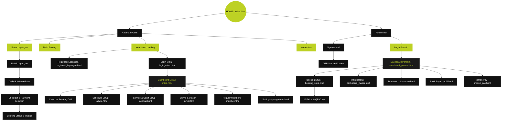

# Minton - Information Architecture & Sitemap (MVP)

Dokumen ini berisi rancangan Arsitektur Informasi (IA) dan Peta Situs (Sitemap) dari platform **Minton** (sebuah aplikasi web pemesanan lapangan bulutangkis dan komunitas mabar). Rancangan ini disusun berdasarkan analisis mendalam terhadap berkas kode sumber yang ada di repositori frontend (`ui--minton-mvp-main`).

---

## 1. Arsitektur Informasi (Information Architecture)

Arsitektur Informasi Minton dirancang untuk membagi platform menjadi dua sudut pandang utama (portal) dengan ekosistem keuangan terpadu, yaitu **Pemain (Player Portal)** dan **Pengelola GOR (Partner Portal)**.

### A. Pilar Utama Sistem (Core Pillars)
1. **Sewa Lapangan (Court Booking)**: Mempermudah pencarian, verifikasi ketersediaan jadwal, pemilihan lapangan (jenis vinyl, parket, dsb), hingga transaksi *real-time*.
2. **Main Bareng (Mabar & Sparring)**: Memfasilitasi pemain individu untuk menemukan kelompok bermain atau lawan latih tanding seimbang berdasarkan *Skill Level*.
3. **Kemitraan (B2B Court Management)**: Dashboard khusus bagi pemilik/pengelola GOR untuk digitalisasi operasional, penjadwalan member tetap, dan pelaporan keuangan.
4. **Turnamen & Komunitas (Ecosystem & Social)**: Memperluas keterlibatan pengguna dengan mengintegrasikan turnamen kompetitif dan komunitas komunitas lokal.
5. **Akun & Finansial (Auth, Profil & E-Wallet)**: Pengaturan data pribadi, pencatatan statistik (tingkat kemenangan), serta integrasi dompet digital **Minton Pay**.

### B. Sistem Pelabelan & Navigasi (Labeling & Navigation)
*   **Navigasi Utama (Header)**: Menggunakan terminologi fungsional yang lugas: *Sewa Lapangan*, *Main Bareng*, *Kemitraan*, *Komunitas*, *Sign-up*, *Login*.
*   **Navigasi Dashboard Pemain (Aside Menu)**: Berorientasi aksi pribadi: *Dashboard*, *Booking Saya*, *Main Bareng*, *Turnamen*, *Profil*, *Minton Pay*, *Keluar*.
*   **Navigasi Dashboard Mitra (Aside Menu)**: Berorientasi bisnis & kontrol: *Booking* (Kalender Mingguan), *Schedule* (Jadwal Operasional), *Service* (Layanan Lapangan & Tarif), *Survey* (Ulasan Pengunjung), *Members* (Anggota Tetap), *Settings*, *Keluar*.

---

## 2. Peta Situs (Sitemap)

Sitemap hierarkis berikut ini diwakili melalui kode alur (diagram) dan pemetaan halaman secara mendetail.

### A. Visualisasi Sitemap (Mermaid Diagram)

---

### B. Detail Struktur Halaman (Page Structure Details)

#### 1. Landing Page Umum (`/frontend/index.html`)
*   **Hero Section**: Judul utama persuasi ("Booking Kilat. Main Hebat"), CTA ke pencarian lapangan dan main bareng.
*   **Kenapa Minton Section**: 3 buah *USP* (Unique Selling Points): Booking tanpa antre, transparansi kualitas lapangan, verifikasi pembayaran aman.
*   **Partner Main Section**: Gambaran fitur pencarian kelompok tanding berdasarkan tingkat keterampilan dengan sistem reputasi / rating pemain.
*   **Statistik & Ranking**: Peringkat wilayah bulanan dan *Badges of Honor* (lencana digital prestasi pemain).
*   **Testimonial**: Menampilkan ulasan autentik pemain.
*   **CTA Bawah & Footer**: Link cepat ke profil perusahaan, direktori lapangan, dan pendaftaran kemitraan.

#### 2. Alur Sewa Lapangan (`/frontend/sewa lapangan/`)
*   **`sewa_lapangan.html`**: Direktori pencarian lapangan dengan bilah pencarian nama venue, pencarian kota terintegrasi, dan modal filter lengkap (Kategori olahraga, jenis lantai karpet/kayu, ketersediaan toilet & kantin).
*   **`detail_lapangan.html`**: Halaman deskripsi menyeluruh properti olahraga (lokasi map, ulasan bintang, fasilitas detail), foto-foto per sudut, dan pemindai detail lapangan yang tersedia.
*   **`Jadwal_ketersediaan_lapangan.html`**: Interaksi berupa grid penunjuk waktu operasional per jam untuk mencocokkan waktu luang pemesan.
*   **`checkout.html`**: Halaman rincian tagihan pesanan, metode bayar (pilihan via Minton Pay Virtual Account atau E-Wallet), syarat pembatalan, dan konfirmasi.
*   **`boking_status_badminton.html`**: Peringatan status tagihan selesai atau sedang menunggu pembayaran.
*   **`list_booking.html`**: Rekapitulasi pemesanan lapangan oleh pengguna/pemain.

#### 3. Alur Hubungan Mabar (`/frontend/main bareng/` & `/frontend/komunitas/`)
*   **`main_bareng.html`**: Halaman pencarian grup bermain badminton. Menampilkan tingkat keahlian (*Beginner/Intermediate/Pro*), slot kosong, gender, alamat GOR, jam main, serta biaya sewa per orang untuk patungan.
*   **`komunitas.html`**: Halaman direktori komunitas perkumpulan badminton, diskusi forum lokal, agenda latihan rutin bersama, serta foto dokumentasi kumpul komunitas.

#### 4. Portal Pemain Internal (`/frontend/`)
*   **`dashboard_pemain.html`**: Rekap personalisasi pemain yang terdiri dari jumlah permainan tanding diikuti, total sewa, tingkat kemenangan, level pemain saat ini, daftar teman aktif, riwayat perolehan *Minton Points*, serta jadwal bermain terdekat.
*   **`booking_saya.html`**: Pengelolaan seluruh transaksi booking lapangan. Dipisahkan menjadi tab (Aktif, Menunggu Pembayaran, Riwayat, Dibatalkan). Fitur ini memiliki aksi instan untuk membuka *E-Ticket* yang menampilkan QR Code booking untuk ditunjukkan pada penjaga GOR.
*   **`dashboard_mabar.html`**: Dashboard komunitas khusus pencarian mabar yang sedang aktif di sekeliling wilayah pemain.
*   **`profil.html`**: Pengeditan data pribadi, pengaturan kata sandi, ulasan reputasi dari pemain lain, serta tampilan badge gelar.
*   **`minton_pay.html`**: Layanan dompet digital terpadu buatan Minton. Menampilkan riwayat mutasi masuk/keluar saldo, fitur top up dana, dan kustomisasi PIN transaksi.
*   **`turnamen.html`**: Pusat jadwal kompetisi turnamen resmi lokal yang berjalan dengan sistem pendaftaran daring satu klik terintegrasi dengan tim/pasangan pemain.

#### 5. Portal Mitra Bisnis (`/frontend/kemitraan/`)
*   **`kemitraan.html`**: Landing page B2B yang menjelaskan kemudahan kelola GOR secara digital, otomatisasi mutasi transfer bank, jangkauan pasar, dan statistik performa bisnis.
*   **`registrasi_lapangan.html`**: Formulir pendaftaran properti GOR oleh pemilik (info nama gor, jenis sewa, jumlah lapangan, harga jam biasa/malam).
*   **`login_mitra.html`**: Autentikasi pengembang pengelola GOR.
*   **`mitra.html`**: Dashboard utama merchant. Memiliki statistik pendapatan harian, kapasitas lapangan penuh, rating kepuasan pelanggan, notifikasi masuk pemesanan, dan tabel kalender jadwal mingguan (menunjukkan slot waktu terisi, kosong, atau ditutup).
*   **`jadwal.html`**: Kontrol manajemen waktu operasional lapangan, pengelolaan jam khusus diskon, serta pemesanan waktu kosong khusus pelanggan/member mingguan tetap.
*   **`layanan.html`**: Setup fasilitas tempat (ganti jenis lapangan karpet/kayu, tambah foto, setup sewa alat tambahan seperti raket/kok).
*   **`survei.html`**: Rekap penilaian dan ulasan survei kepuasan pelanggan (bintang 1-5 dan saran tertulis) untuk analisis pelayanan operasional.
*   **`member.html`**: Panel verifikasi member tetap langganan bulanan di GOR. Berisi informasi tanggal aktif member dan kemudahan pemotongan otomatis ketersediaan jadwal.
*   **`pengaturan.html`**: Pengaturan profil GOR, akun bank pencairan dana, batas waktu toleransi pembayaran batal otomatis, dan preferensi notifikasi e-mail/WhatsApp.

---

## 3. Matriks Alur Data Pengguna (Key User Journeys)

> [!NOTE]
> ### 1. Alur Sewa Lapangan oleh Pemain (Pemain Booking Flow)
> `index.html` → `sewa_lapangan.html` → `detail_lapangan.html` → `Jadwal_ketersediaan_lapangan.html` → `checkout.html` → `boking_status_badminton.html` → `booking_saya.html` (Terima E-Ticket QR Code).

> [!TIP]
> ### 2. Alur Penerimaan Booking oleh Mitra (Mitra Grid Sync Flow)
> Pembuat booking selesai membayar → Mutasi Minton memverifikasi pembayaran → Notifikasi *Real-Time* masuk ke `mitra.html` (dashboard mitra) → Grid kalender jadwal mingguan berubah status dari warna abu-abu (Empty/Tersedia) menjadi hijau (Booked/Terkonfirmasi).
